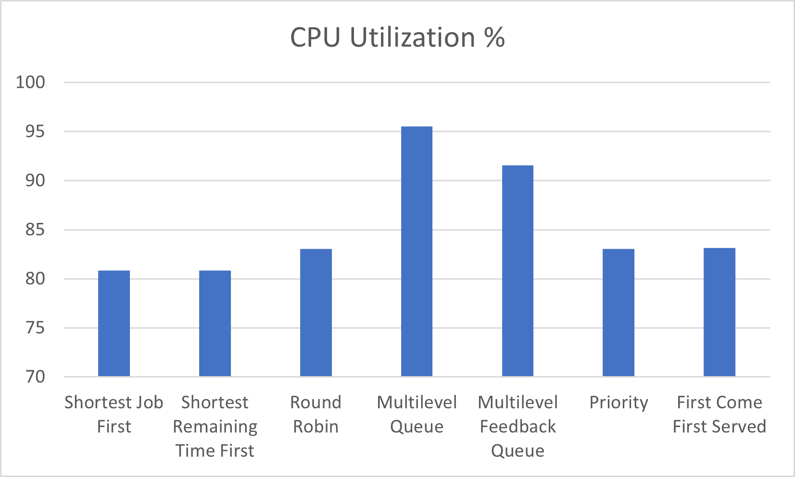
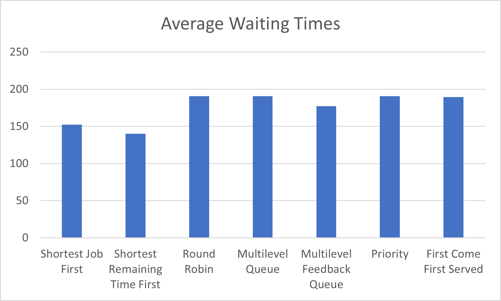
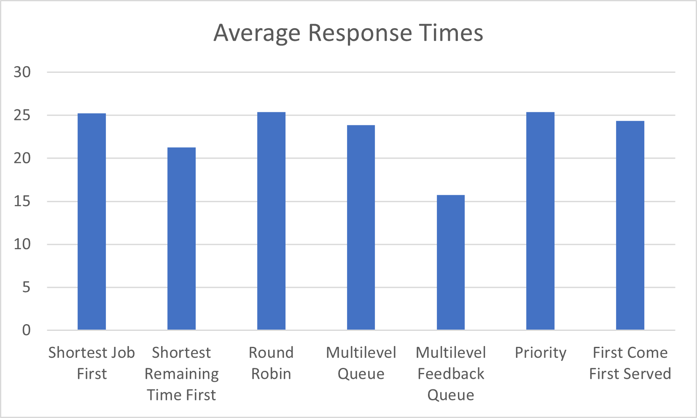
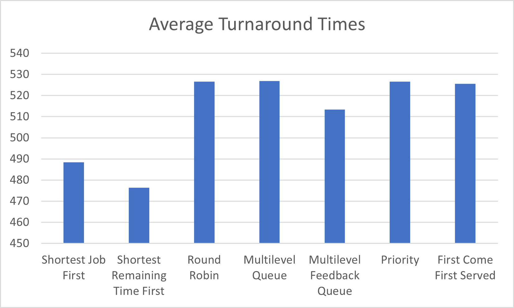

# Part 4: Report 

## Table of Contents

Section I - Introduction

Section II - Algorithms

Section III - Report Preemptive FCFS

Section IV - UML Diagram

Section V - Final Results - tables, plots

Section VI - Discussion on what is best solution to implement

## Section I - Introduction - J.Damo

**Scope** of the project to learn about OS scheduling through simulation programming using Java programming along with scheduling analysis
and integration. The goal of the project for attainment of knowledge of Operating System CPU scheduler algorithms.

**Specific**: Work as a team H2O to implement 8 CPU scheduling algorithms: 1) First Come First Serve (FCFS) non-preemptive, 2) FCFS preemptive
in a report, 3) Shortest Job First (SJF) non-preemptive, 4) Preemptive Shortest Remaining Time First (SRTF), 5) Priority Scheduling, 6) Round
Robin with Quantun 5, 7) Multilevel Queue, and 8) Multilevel Feedback Queue.

**Measurable**: Assumptions will be made accordingly as follows: 1) all processes are activated at time 0, 2) no process waits on I/O devices, 
3) upon completion I/O event process transferred to ready queue, 4) the waiting time accumulated while a process waits in ready queue, 5)
turnaround time it total of (waiting time) + (CPU burst time) + (I/O time), and lastly 6) response time is the first measure of waiting time
from arrival at time 0 until the first time on the CPU.

**Accuracy**: The process data goes CPU burst, I/O time. CPU burst, I/O time until last CPU burst. Therefore, implementation of the algorithms
with Java results to be evaluated in terms of the metrics taking into consideration in the following: 1) current execution time, 2) running
process, 3) ready queue with CPU burst time for each process, 4) processes in I/O, and 5) process completion its total execution. See Section
IV for UML Diagram and Section V for Final results to tables, plots, and Section VI for Discussion on what is the best solution for
implementation.

**Time**: The turnaround time for completing the CPU scheduling project took into consideration two milestone meeting dates: 1) first milestone
date was May 5th where the project board was filled out about who was assigned to the algorithms, 2) May 16 the CPU scheduler draft was due
where one algorithm per person implemented along with utility functions and classes created, 3) second milestone date was May 19th where the 
second algorithm should be implemented by each person and the Final Report started. Lastly, final date to turn in total project May 28th.

### Attribution Requirement:

Part 1: Designing the Experiment - A.Bower

Part 2: Java Implementation - A.Bower and N.Trimmer

Part 3. Output and Testing - A.Bower and N.Trimmer

Part 4. Report and Version Control for Project Board - J.Damo

## Section II - Algorithms

### Algorithm Multilevel Queue - A.Bower

A multi-level queue scheduling algorithm partitions the ready queue into several separate queues. The processes are permanently
assigned to one queue, generally based on some property of the process, such as memory size, process priority or process type.
The advantages of multi-level queue cpu scheduling are the following: low scheduling overhead, efficient allocation of CPU time, 
fairness as to fair allocation of CPU time, customizable, priorization, and preemption. On the other hand the disadvantages are 
that some processes may starve for CPU if some higher priority queues are never becoming empty or else it is inflexible in nature.

### Algorithm Multilevel Feedback Queue - A.Bower

Cpu scheduling as like multi-level queue (MLQ) scheduling but in this process can move between the queues. And much more
efficient than multi-level queue scheduling. The advantage of multi-level feedback queue scheduling are the following: flexible,
allows different processes to move between different queues, and prevents starvation by moving a process that waits too long for 
the lower priority queue to the higher priority queue. On the other hand disadvantages of multi-level feedback queue scheduling
are the it produces more CPU overheads and the most complex algorithm.

### Algorithm Round Robin - B.Mester

Round Robin is a CPU scheduling algorithm where each process is assigned a fixed time slot in a cyclic way. It is basically the preemptive
version of First Come First Serve CPU scheduling algorithm and thus focuses on Time Sharing technique. While performing a round robin scheduling
a particular time quantun is allotted to different jobs. Each process get a chance to reschedule after a particular quantum time in this
scheduling; usually with larger waiting time and response time. The disadvantages of using round robin if slicing time of operating system
is low, the processor output will be reduced. Round robin performance heavily depends on time quantum. Priorities cannot be set for the
processes.

### Algorithm Priority Scheduling - B.Mester

Lower the number, higher is the priority in which if a newer process arrive, that is having a higher priority than the currently running
process, then the currently running process is preempted. Processes with the same priority are executed on a first come first served
basis. Therefore, priority can be based on memory requirements, time requirements, or any other resource requirement. Also priority can
be decided on the ratio of average I/O to average CPU burst time. Advantage is that priority based scheduling ensures high-priority processes
are executed first which leads to faster completion of critical tasks. The two main disadvantages of priority scheduling are priority inversion
in which occurs when a low-priority process holds a resource that a high-priority process requires that may cause delays of execution and the
second disadvantage is starvation in which if the system is heavily loaded with high-priority processes, low-priority processes may never
get a change to execute.

### Algorithm Shortest Job First (SJF) nonpreemptive - N.Trimmer

Basically when a the CPU finish the current job it will select the shortest job in the queue to execute next. Therefore, it selects the waiting
process with the smallest execution time to execute next. Shortest job first has the advantage of having a minimum average waiting time among
all scheduling algorithms. It is a Greedy algorithm which may cause starvation if shorter processes keep coming; this problem can be solved
using the concept of ageing. Advantage of SJF is reduces the average waiting time and it is generally used for long term scheduling. On the
other hand the disadvantages are that SJF may cause very long turn around times or starvation; and other disadvantage it is complicated to 
predict the length of the upcoming CPU request.

### Algorithm Shortest Remaining Time First (SRTF) - N.Trimmer

The shortest remaining time first algorithm the process having the smallest amount of time remaining until completion is selected first to
execute. So, basically in SRTF the processes are scheduled according to the shortest remaining time. Processes will always run until they 
complete or a new process is added that requires a smaller amount of time. SRTF a dynamic algorithm meaning it can adapt to changes in the 
arrival time and burst time of processes. Where it can re-evaluate the remaining burst time of each process and schedules the process with
the shortest remaining time. Advantages if SRTF are the short processes are handled very quickly. On the other hand, the disadvantage is
that like shortest job first it has the potential for process starvation with long processes can be held off indefinitely if short processes
are continually added.

### Algorithm First Come First Serve (FCFS) - J.Damo & N.Trimmer

The first come first serve scheduling algorithm in the process which arrive first gets executed first. It is implemented by using the FIFO 
queue which is the simplest scheduling algorithm in that the FIFO simply queues processes in the order they arrive in the ready queue.
Advantage for FCFS is that it is simple and easy to understand with a process with less execution time suffers ie waiting time is often
quite long. Disadvantages is that important jobs with higher priority have to wait along with not guaranting good response time. Other
disadvantages of FCFS are the average waiting time and turn around time is oten quite lone with lower CPU and device utilization.

## Section III - Report Preemptive FCFS

### Report Preemptive FCFS in report section - J.Damo

First Come First Serve (FCFS) can be defined as a type of scheduling algorithm used by operating system and networks to measure efficiency,
therefore automatically execute queued tasks along with processes and request by the order of their arrival.

What is preemption is and what happens when attempting to create a preemptive FCFS algorithm? The answer is that in an operating system in
preemptive scheduling is a type of scheduling method in which the CPU is allocated for a limited time to a given given process. On the
other hand in contrast non-preemptive scheduling is the type of scheduling technique in which the CPU is allocated to a process and held
by it until the process gets terminated.

How does the FCFS preemptive transform? FCFS in preemptive priority scheduling algorithms in which the processes come with  a priority
attached to them. Therefore, the lower the priority number, the higher is the priority attached to the process. Likewise, a process with
higher priority on its arrival preempts an ongoing process.

In evaluating the FCFS preemptive scheduling process in contrast. FCFS executes processes in the same sequence as they enter the ready
queue in contrast to preemptive priority where it executes those processes first that have the highest priority. Usually FCFS is the
simplest process for CPU scheduling where as preemptive FCFS is more complicated to implement. In conclusion, I do not thnk FCFS
preemptive can be implemented without transforming into priority queues because of the necessity of implimenting the lower and higher
priority queues. Therefore, the preemptive FCFS without the priority queues could not possibly start the processes.

## Section IV - UML Diagram - A.Bower

## Section V - Final Results - tables, plots

## Discussion and Tables for:

<ul>
  <li>U (CPU utilization</li>
  <li>Tw (waiting times)</li>
  <li>Ttr (turnaround times)</li>
  <li>Rt (response time)</li>
  <li>All processes and averages for each algorithm</li>
</ul>

## Plots

<ul>
  <li>CPU utilization data for algorithms</li>
  <li>Average Waiting time: data for all algorithms</li>
  <li>Average Turnaround time: data for all algorithms</li>
  <li>Average Response Time: data for all algorithms</li>
</ul>

## Section VI - Discussion on what is best solution to implement. A.Bower
As far as what the optimal solution to implement is there is some discussion to be had. Our average waiting times were pretty consistent across all algorithms with all but one falling between 150 and 200. Preemptive SJF was the winner in this regard with an average waiting time under 150, meaning it is preferrable if waiting time is a priority. For response time we saw ranges from 16 for the multi-level feedback queue, to 26 for priority and round robin. MLFQ seems the runaway favorite in this category with all other algorithms falling in the 21-26 range. For turnaround time it was not even close, as might be predicted the SJF algorithms did the best by far, with numbers for the preemptive version reaching almost 50 less than some other algorithms. MLFQ scored the best out of the non-SJF algorithms but still failed to get below 510, while both of them sat under 490. In terms of cpu utilization MLQ came out on top. The number of internal cpu ticks before resetting was adjustable and therefore begged for optimization. At a naive value of 50 the algorithm had a cpu utilization of ~88%, but by trialling all values between 25-150 we were able to settle on the number 73 which produced cpu utilization of over 95%. MLFQ also delivered over 90% utilization while boasting better numbers in the other categories than MLQ. As far as what the most efficient solution is, the numbers seem to suggest that it is preemptive SJF. Followed by the non preemptive variant and then MLFQ. The reason for this seems clear, it is the only algorithm that takes into account the time each process will take, so in a simulation where the processes are all equally important, it will always have key insight that the other algorithms lack. Even it's low cpu utilization numbers we believe to be due to it's ability to send all of the processes to IO more efficiently than its peers, and due to the long io/burst ratio for the simulation it becomes more idle. It seems it might be necessary to demo the algorithm on a much larger pool of processes to test what it's actual utilization might be.

